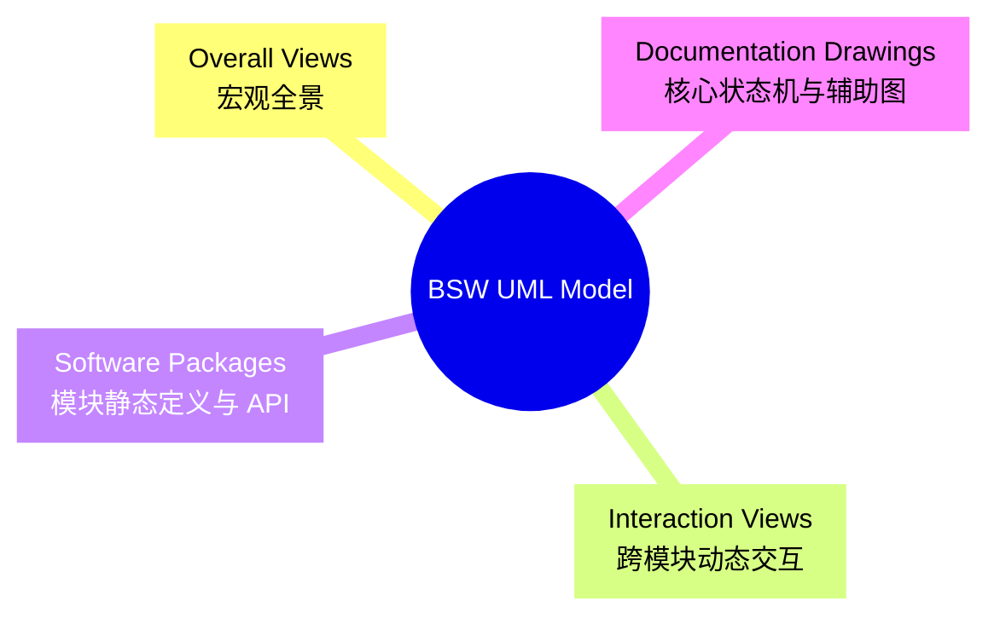
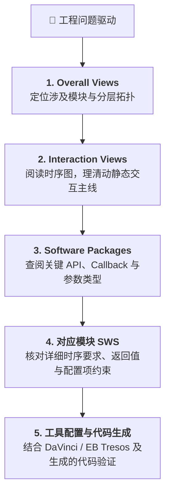

## 背景

这是 AUTOSAR 学习系列番外的番外篇。在上一篇的结尾有提到过可以用 EA 看官方模型，仔细查看后发现，官方模型是不可多得的学习材料，值得再深入讲讲。

相比晦涩的 SWS 文本规范，图形能帮我们在脑海中瞬间建立直观骨架。本文梳理如何利用官方 UML Model 建立 AUTOSAR BSW 的整体认知。

### 什么是 AUTOSAR BSW UML Model

AUTOSAR 官方在发布 CP 规范包时，除了 PDF 规范外，还会随附一份 UML 模型（通常是 `MOD` 类文档，如 `AUTOSAR_MOD_BSWUMLModel.zip`）。它本质上是所有 BSW SWS 规范中架构图、时序图与类图的「设计母版」：

- **静态结构**：完整定义了各 BSW 模块的组件关系、对外提供/引用的接口、API 签名与数据类型
- **动态行为**：包含典型场景下的跨模块交互时序图与核心模块的状态机
- **可追溯性**：在 EA 中所有元素均有关联关系，支持双向跳转与依赖反查，要比翻阅 PDF 高效

## 准备工作

1. **获取官方模型**：访问 [Search AUTOSAR](https://www.autosar.org/search)，搜索 `BSW UML Model`，在 Doc Type 中筛选 `MOD` 下载。

2. **安装查看工具**：解压后找到 `.eap` 并使用 Enterprise Architect 打开[^au1]。

[^au1]: Enterprise Architect 首次打开会提示 Project Transfer 并创建一个新的 `.qea` 文件

3. **建立学习副本**：保留一份未修改的原始副本。若需要在模型中添加标注或自定义视图，建议新建独立的根包（如 `Learning_Sandbox`），不要直接更改官方包结构。

## 模型目录

模型工程树内容庞大，不必逐个展开阅读，重点聚焦以下 4 个核心入口：

### Overall Views

这里通常放 AUTOSAR 分层架构、BSW 模块分布和模块之间的宏观依赖。

### Interaction Views

这里主要是跨模块的时序图。

> 官方建模指南规定，Interaction Views 用于放置不同模块之间的交互时序图，并按软件栈组织；这些时序图用于表现 BSW 模块之间的典型用例，并被纳入对应 SWS。

当你想理解“一帧报文如何收发”、“一次诊断请求如何响应”、“一次 NvM 数据如何异步读写”时，应优在这里找找：

- **典型时序**：主控调用链路与模块流转
- **调用性质**：区分同步轮询、同步阻塞与异步回调
- **异常流向**：如超时、校验失败、Bus-off 等异常分支的触发与通知机制

比如，下面是模拟 EEPROM（Fee_Write）的写时序图，描述的是 NvM 发起一次写请求，经过 MemIf → Fee[^au2] → Fls，最终把数据写入 Flash，并通过 JobEndNotification 逐层通知完成。

[^au2]: Flash EEPROM Emulation

对应的，这是真实 EEPROM（Ea_Write）的写时序图：

对比两张时序图会发现，Fee 的复杂度要高于 Ea：

- Ea 更像一个转发模块：EEPROM 物理特性支持字节级随机读写与原地覆盖。因此 Ea 只需做 32 位逻辑地址到物理偏移的线性映射，将 NvM 的请求打包转发给底层的 Eep 驱动，调用链很平直
- Fee 是一个真正的内部状态机模块：Flash 物理特性决定其不能原地覆盖，必须“先按扇区擦除、再按页写入”，且擦写寿命有限。为了在只支持块擦除的 Flash 上“模拟”出 EEPROM 的随机读写能力，Fee 内部必须依赖复杂的状态机驱动，包括动态映射、扇区轮转、垃圾回收和掉电安全

尽管下层机制差异很大，但对于上层的 NvM 来说，通过 MemIf 调用的却是完全相同的 `MemIf_Write` 接口与异步 Job 模型。NvM 既不需要关心当前操作的是 Flash 还是 EEPROM，更无需理会底层是在做垃圾回收还是在做直接的物理覆写。

### Software Packages

当需要落地到代码或查阅具体 API 时，从 Software Packages 进入对应模块包：

- **模块组件**：对外提供的 Required/Provided 接口
- **API 列表**：函数名称、入参、出参及返回值类型
- **Callback 规范**：下层向上层通知的统一回调规范
- **Header File Diagrams**：模块间头文件的包含关系，帮助理清编译依赖

比如下图是 Fee 模块的提供的接口图，路径位于 `AUTOSAR.SoftwarePackages.ECUAL.MemHwA.Fee.Fee Provided Interfaces`：

### Documentation Drawings

这里放的是状态机和活动图，主要是网络管理与通信控制模块相关的。这些模块往往不是简单的数据转发，状态和模式是理解行为的核心。

比如下图是 DEM 模块处理故障的活动图，可以帮助我们更好理解 Event 从“检测到故障”到“生成 DTC 并存储”的核心流程：

## 学习流程

同阅读 PDF 一样，不建议无目的地漫游模型，还是要以具体的工程问题为切入点：

- 一帧 CAN 报文从应用发出到硬件发送经历了什么？
- CAN 报文接收后如何解析并通知到 RTE/SWC？
- 发生 Bus-off 后，CanSM 与 CanIf 如何协调恢复？
- NvM 读取 Block 时底层的异步任务是如何轮询完成的？
- ComM 如何协同各个通道的通信模式？

推荐参考如下路径展开学习：

## 总结

AUTOSAR BSW UML Model 最大的价值，倒不在于具体画了多少张图，而是把散落在几十个 SWS 规范里的模块、接口、数据类型和状态机，串成了一张能随时点击、跳转和导航的全局地图。比起直接硬啃大段的英文规范，先看图理顺逻辑确实要友好得多。

另外，如果你平时工作里也用 EA 做软件设计和架构，官方这份工程也是现成的参考样本[^au3]。

[^au3]: 本人还是习惯 Diagrams as Code，比如 Mermaid 或 PlantUML