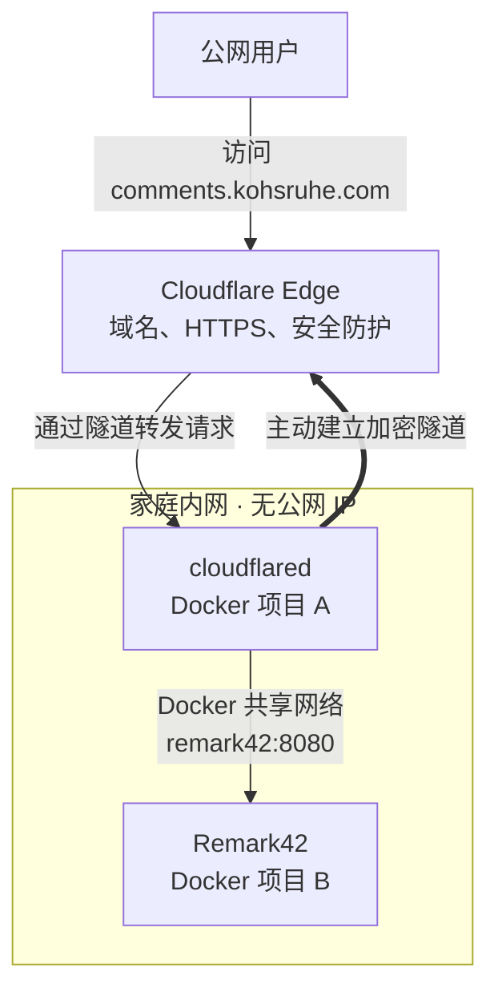

## 起因

博客之前的评论系统是参考了 [Pseudoyu](https://www.pseudoyu.com/zh/2022/05/24/free_and_lightweight_blog_comment_system_using_cusdis_and_railway) 的教程做的。Cusdis 整体使用下来很轻量，界面也很简约，挺适合我这种无人问津的小站。但有几个不太舒服的点：

- 数据托管在官方的 Free Plan，功能有限，有时候会抽风打不开
- 后台比较简陋，缺少基本的反垃圾和通知能力
- 评论需要管理员手动审核，经常错过评论和及时回复

但真正让我下决心换掉的是这个 iframe bug：评论区被压成一个小框带滚动条，要手动拉才能看到完整内容。issue [#283](https://github.com/djyde/cusdis/issues/283) 开了快 2 年没修，社区的 workaround 都是手动 JS 重设 iframe 高度或者 MutationObserver 监听 resize，相当 hacky；连 Cusdis 自己的 [官网](https://cusdis.com/doc#/faq) 也中招。


## 选型

对评论系统的要求很简单：

- **自托管**，数据在自己手里
- **轻量**，单二进制 / 单容器就能跑
- **支持 OAuth 或者匿名登录**，别让访客为了评论再注册一个账号
- **评论通知**，及时阅读和回复

也是看了 [Pseudoyu](https://www.pseudoyu.com/zh/2024/07/22/free_commenting_system_using_remark42_and_flyio) 的文章选的 Remark42：

- 单容器部署，bolt 文件存储，零依赖
- 内置 GitHub、Google、Twitter、Telegram 等十几种 OAuth
- 评论数据存在本地 bolt 文件
- 自带 admin 后台，OAuth 登录白名单管理

不过 [fly.io](https://fly.io/) 已经没有免费计划了，所以也一直没迁移过来。直到最近折腾了 Cloudflare Tunnel，确实可以托管在自家的 NAS 上然后暴露到公网，这样一来就更方便了，搞起。

## 整体架构



> 对比以 FRP 一类的公网中转方案，主要区别是 Cloudflare Tunnel 使用 Cloudflare Edge 作为公网入口，并集成域名、HTTPS 和安全能力，而一般内网穿透通常依赖一台自行维护的公网中转服务器及端口映射。

## 部署 Remark42

最小可用 `docker-compose.yml`：

```yaml
services:
  remark42:
    image: ghcr.io/umputun/remark42:latest
    container_name: "remark42"
    hostname: "remark42"
    restart: always

    logging:
      driver: json-file
      options:
        max-size: "10m"
        max-file: "5"

    ports:
      - "8080:8080"

    environment:
      # Basic setup
      REMARK_URL: "https://comments.kohsruhe.com"
      SITE: "kohsruhe"
      SECRET: "<random-long-string>" # openssl rand -hex 32
      DEBUG: "false"
      ALLOWED_HOSTS: "localhost,www.kohsruhe.com"
      AUTH_SAME_SITE: "lax"
      AUTH_ANON: "true"

      # Enable Email login
      AUTH_EMAIL_ENABLE: "true"
      AUTH_EMAIL_FROM: '"Remark42 Login" <kohsruhe@gmail.com>'
      AUTH_EMAIL_SUBJ: "Confirm your Remark42 login"
      AUTH_EMAIL_CONTENT_TYPE: "text/html"

      # GitHub setup
      AUTH_GITHUB_CID: "<from-github>"
      AUTH_GITHUB_CSEC: "<from-github>"
      ADMIN_SHARED_ID: "github_<your-user-id>"

      # Gmail SMTP setup
      SMTP_HOST: "smtp.gmail.com"
      SMTP_PORT: "465"
      SMTP_TLS: "true"
      SMTP_STARTTLS: "false"
      SMTP_USERNAME: "kohsruhe@gmail.com"
      SMTP_PASSWORD: "<xxxx xxxx xxxx xxxx>"
      SMTP_TIMEOUT: "10s"
      SMTP_INSECURE_SKIP_VERIFY: "false"

      # Notify users
      NOTIFY_USERS: "email"
      NOTIFY_EMAIL_FROM: '"Remark42 Notifications" <kohsruhe@gmail.com>'
      NOTIFY_EMAIL_VERIFICATION_SUBJ: "Confirm your comment subscription"

      NOTIFY_ADMINS: "slack"
      NOTIFY_SLACK_CHAN: "remark42"
      NOTIFY_SLACK_TOKEN: "xoxb-<your-slack-token>"
      
    volumes:
      - ./var:/srv/var
```

`./var` 目录用来存 bolt 数据和上传图片，建议挂到 NAS 的持久化卷。

## 配 GitHub OAuth

去 [GitHub Developer Settings](https://github.com/settings/developers) → New OAuth App：

- Application name: `Kohsruhe Comments`
- Homepage URL: `https://www.kohsruhe.com`
- Authorization callback URL: `https://comments.kohsruhe.com/auth/github/callback`

注册后拿到 Client ID 和 Client Secret，填到上面 `AUTH_GITHUB_CID` / `AUTH_GITHUB_CSEC`。

## 启动并配置 admin

第一次启动先不设 admin，先把 Remark42 跑起来。

在博客页用 GitHub 登录一次评论系统，点用户名右侧展开会显示完整的 user ID（`github_` 开头的一长串 hex），复制这段。


然后停掉容器，env 里加上 `ADMIN_SHARED_ID=github_<your-user-id>`，重启即可。

## 集成到 Hugo

在 `layouts/partials/remark42.html` 里：

```html
<div class="comments">
  <div class="title">
    <span>Comments</span>
    <span class="counter"><span class="remark42__counter" data-url="{{ .Permalink }}"></span></span>
  </div>
  <div id="remark42"></div>
</div>

<script>
  var remark_config = {
    host: 'https://comments.kohsruhe.com',
    site_id: 'kohsruhe',
    components: ['embed', 'counter'],
    max_shown_comments: 20,
    simple_view: true,
    theme: 'light',
  }
</script>

<script>
  ;(function () {
    // init or reset remark42
    const remark42 = window.REMARK42
    if (remark42) {
      remark42.destroy()
      remark42.createInstance(remark_config)
    } else {
      for (const component of remark_config.components) {
        var d = document,
          s = d.createElement('script')
        s.src = `${remark_config.host}/web/${component}.mjs`
        s.type = 'module'
        s.defer = true
        // prevent the <script> from loading mutiple times by InstantClick
        s.setAttribute('data-no-instant', '')
        d.head.appendChild(s)
      }
    }
  })()
</script>
```

同时在 `layouts/posts/single.html` 末尾 `{{ partial "remark42.html" . }}` 引用即可。

## 总结

整个迁移的代码量比想象中少：Remark42 单 docker 镜像、GitHub OAuth 一个 callback URL 就完事。真正花时间的是 Cloudflare Tunnel 的配置，那部分单独写一篇。

感恩赛博菩萨! 🙏
