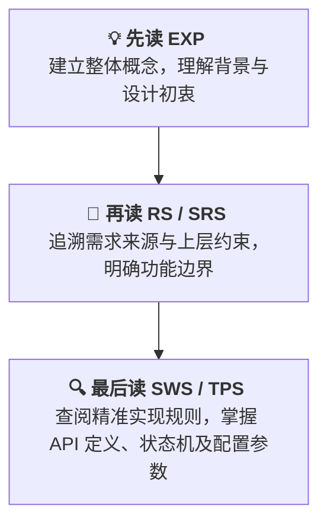
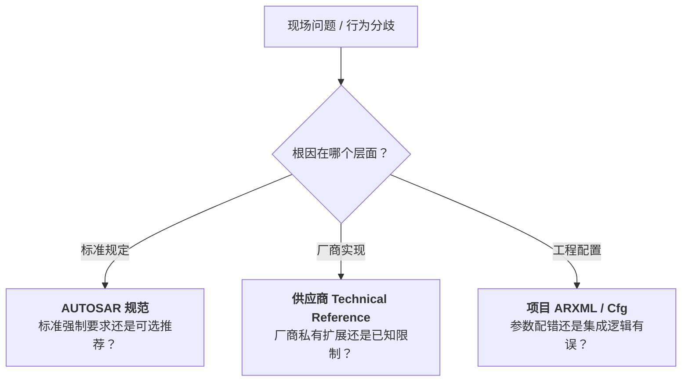
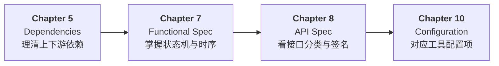

本文是 AUTOSAR 系列的番外篇。深入学习 AUTOSAR，终究离不开官方规范。但面对其庞杂的文档体系，往往容易让人无从下手，因此有必要专门梳理一下官方文档的阅读方法。

## 文档入口

从下面这个地址可以直达，左边可以做过滤，比如释放版本、文档类型、模块等等。

- [Search AUTOSAR](https://www.autosar.org/search) 

目前，提供的文档主要有以下几大类：

| 缩写 | 英文全称 | 文档主要内容 |
| :---: | :--- | :--- |
| RS | Requirements Specification | 平台级、功能级或领域的总体需求 |
| SRS | Software Requirements Specification | 对一组软件模块提出的公共软件需求 |
| SWS | Software Specification | 某个具体软件模块的完整规范（API、状态机、配置） |
| TPS | Template Specification | 系统模板、方法论、数据交换和配置模型规范 |
| EXP | Explanatory Document | 对复杂概念、架构或规范使用方式的解释 |
| TR | Technical Report | 发布说明、术语表、补充材料及非规范性报告 |
| MOD | Model | AUTOSAR 模型、蓝图或模型数据 |
| MMOD | Meta Model | AUTOSAR 元模型及其生成产物 |

### RS: Requirements Specification

RS 通常是比较高层的需求文档，回答 AUTOSAR 为什么需要这个能力，以及这个能力总体上必须满足什么要求？这类文档一般不会告诉你某个 API 的参数如何定义，而是描述功能目标、使用场景、系统约束、安全性和兼容性要求等。

### SRS: Software Requirements Specification

SRS 比 RS 更接近软件架构层，但通常还不是某个具体模块的最终实现规范。SRS 经常定义某类基础软件模块共享的软件需求，比如通信、诊断、存储等相关的公共需求。

### SWS: Software Specification

这是做 BSW 开发时最常阅读的文档类型。SWS 通常包含：模块职责与边界、依赖关系、API 定义、数据类型、状态机或行为描述、错误处理、配置参数等等。

### EXP: Explanatory Document

EXP 是解释性文档，主要帮助读者理解规范背后的概念和使用方式，它往往比 SWS 更适合入门，但通常不作为开发符合性判断的唯一依据。建议的阅读顺序：

对于大多数使用成熟工具进行 AUTOSAR 配置和集成的工程师而言，没有必要系统阅读全部 AUTOSAR 官方文档。实际工作通常以工具厂商提供的技术文档、User Manual 和集成指南为主，并在需要确认模块标准行为时查阅对应的 SWS。

对于 AUTOSAR 工具开发者、BSW 或 MCAL 开发者，以及需要手写 CDD 或其他 AUTOSAR 相关代码的工程师，则需要根据具体问题进一步阅读 SWS、TPS、MMOD 等文档，理解接口行为、配置模型、协议规则和工具生成逻辑。

## 开发阅读建议

没有人会把 2 万多页[^ats1]的 AUTOSAR 规范当成长篇小说从头读到尾。真这么读，大概率在术语定义和版权声明里就被劝退了。

[^ats1]: 有人做过统计，单 CP 平台的一个版本（22-11）就有 210 个文件，总页数超过 21913

> 理解 AUTOSAR，首先要认识到它是一套标准化规范，而不是某个具体的软件实现。阅读时，核心是厘清它规定了什么、约束了什么，以及哪些内容由具体实现自行决定。

### 区分标准、厂商与项目

实际开发中，我们接触最多的通常不是 AUTOSAR 规范本身，而是 Vector、EB 或芯片厂商提供的配置工具、基础软件和参考文档。遇到行为异常或联调争议时，查规范最大的价值在于区分责任边界：

- **标准规定**：AUTOSAR SWS 明确规定的强制性要求，例如标准返回码、API 行为、状态机及其跳转条件
- **供应商选择**：标准未强制约束或明确允许自行实现的部分，由供应商根据产品架构作出选择，例如内部缓冲队列机制、资源管理策略和扩展 callout
- **项目决定**：由 OEM / Tier 1 或具体项目根据系统需求确定的参数和策略，通常通过 ARXML、生成配置、集成代码

分清这三个层次，才能知道应该查 AUTOSAR SWS、供应商技术文档，还是项目的 ARXML、生成代码与集成逻辑。

### SWS 定模块边界

很多时候，弄清楚一个模块 **不负责什么**，比记住它负责什么更重要。初学者最容易把模块的职责想得过宽：

- **PduR** 只负责 PDU 级别的路由分发，**但不解析其中的 signal**
- **ComM** 负责协调通信模式，**但不直接操作底层 controller**
- **NvM** 负责高层非易失数据块的排队与管理，**但不直接擦写 flash**
- **RTE** 负责组件解耦与数据搬运，**但不负责底层任务调度**

当你对模块产生边界模糊时，在 **SWS** 翻到它向谁提供接口、又依赖谁的接口，职责边界自然就水落石出。

### SWS 重点看什么

一份 SWS 动辄数百页，但工程开发最常用的内容主要集中在四个部分：

1. **Dependencies to other modules**  
   先看模块依赖谁、又被谁依赖，确定它在软件栈中的位置和职责边界。

2. **Functional specification**  
   这是 SWS 的核心。重点关注：
   - **状态机**：模块有哪些生命周期状态？什么条件触发跳转？
   - **MainFunction 与运行时序**：周期函数里究竟在干什么？异步任务的 Job 是如何处理的？

3. **API specification**  
   不必死记每个函数的参数，先按用途理解接口：
   - 初始化（`Init` / `DeInit`）
   - 控制与请求（`RequestMode` / `Transmit`）
   - 回调通知（`RxIndication` / `TxConfirmation`）
   - 周期调度（`MainFunction`）

4. **Configuration specification**  
   配置工具中的复选框、下拉列表和数值参数，通常都能在这里找到对应的标准定义与约束。遇到不理解的配置项，直接按参数名全文搜索即可。

### 问题驱动，而非页码驱动

AUTOSAR 规范不适合漫无目的地通读。更有效的方法是先建立骨架，再带着问题查细节。

**第一遍：30 分钟建立骨架**

暂时跳过 API、配置参数和需求细节，只回答四个问题：

1. 模块解决什么问题？
2. 模块负责什么，不负责什么？
3. 模块与哪些上下游交互？
4. 模块依靠状态机、数据流还是调用链运行？

**第二遍：带着问题按图索骥**

在设计、配置、编码或排错时，把问题具体化为某个接口、状态、配置项或运行场景，再回到 SWS 中精准查找。

### PDF 之外，也可以看模型

AUTOSAR 的部分发布包包含模型文件，可以使用 Enterprise Architect（EA） 工具打开并查看其中的 UML 图，包括模块依赖、接口关系、状态机和时序图。

下图是使用 EA 打开的 `AUTOSAR_MOD_BSWUMLModel.zip`。如果平时使用 EA 进行软件架构设计，这套 AUTOSAR UML 模型是很有价值的学习材料。

